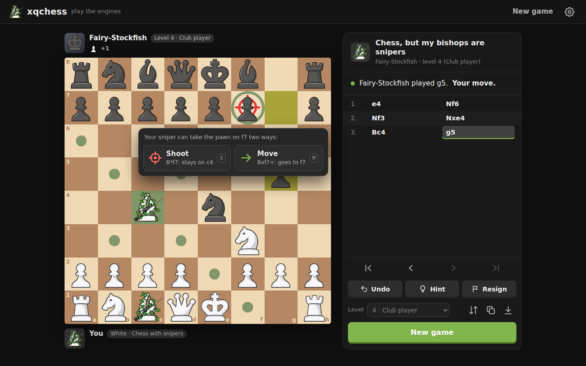
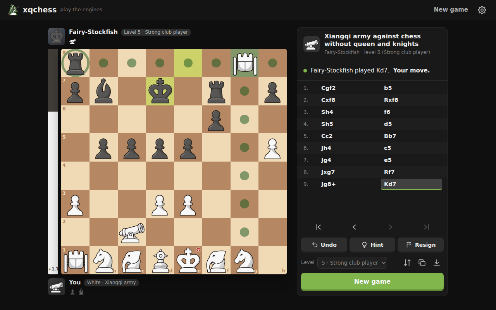
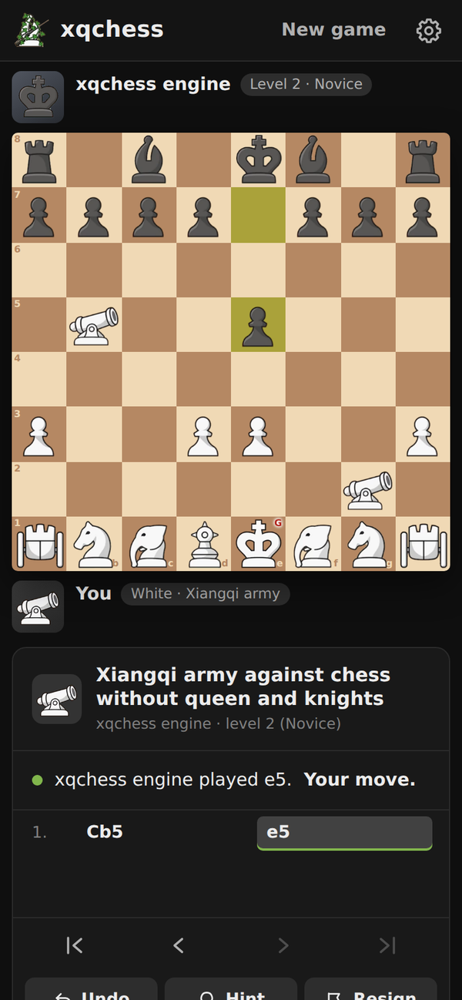
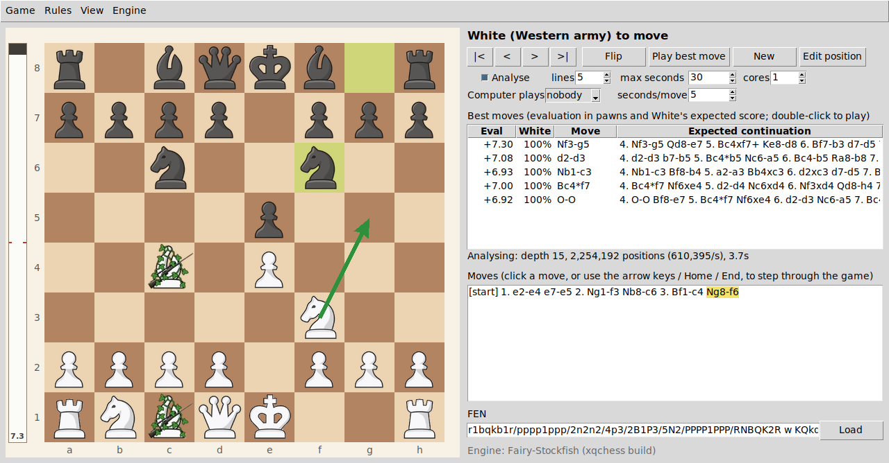

# xqchess

**A Xiangqi army against a Western chess army on an 8×8 board, and snipers chess: three engines, an analysis board, and a web page for playing against the engines.**



xqchess is a workbench for two chess variants:

* **Xiangqi against chess.** The pieces of Xiangqi (Chinese chess): general, advisor, elephants, horses, chariots, cannons and soldiers, face a Western chess army on an ordinary 8×8 board. The Xiangqi rules are adapted so that both armies fit on one board (see [Rules](#rules)). The full chess army wins every game, so the question is which handicap makes the game even. Without its queen and both knights, the chess army scores about the same as the Xiangqi army.
* **Snipers chess.** Ordinary chess, except that White's bishops are *snipers*: they can also take the first enemy piece along a diagonal without moving. That is a huge advantage: from the normal starting position White won all 200 engine games.

It contains:

* **Three engines** that play both games by the same rules:
  * a patched [Fairy-Stockfish](https://github.com/fairy-stockfish/Fairy-Stockfish), the strongest;
  * a compact engine in C++;
  * a pure-Python engine that needs nothing compiled.
* **A web page** (`webplay.py`) for playing White against the engines in any web browser, with six challenges and eight strength levels.
* **An analysis board** (`gui.py`) that lists the engine's best moves while you play through a game, with an evaluation bar and a position editor.
* **Command-line tools** for:
  * analysing positions;
  * engine-against-engine games and statistics;
  * fitting piece values and the evaluation to game results.

Everything runs on your own computer. The web page, the analysis board and the Python engine need only Python. The two fast engines are compiled from source with one command.

## Contents

* [Quick start](#quick-start)
* [Installation](#installation): [Python](#python), [building the engines](#building-the-engines)
* [Playing in the web browser](#playing-in-the-web-browser)
* [The analysis board](#the-analysis-board)
* [Rules](#rules), including [snipers chess](#snipers-chess)
* [What the engines found](#what-the-engines-found)
* [The engines](#the-engines), including [the evaluation and how accurate it is](#the-evaluation-and-how-accurate-it-is) and [Fairy-Stockfish](#fairy-stockfish-for-these-games)
* [Command-line tools](#command-line-tools)
* [Engine protocol](#engine-protocol)
* [How the code was checked](#how-the-code-was-checked)
* [Files](#files)
* [Licence and credits](#licence-and-credits)

## Quick start

Download the repository (on GitHub: **Code**, then **Download ZIP**; or `git clone` it). Then, in its folder:

```bash
python build.py      # compile the two fast engines (optional; needs a C++ compiler, see below)
python webplay.py    # play White against the engines in your web browser
python gui.py        # the analysis board
```

On macOS and Linux type `python3` instead of `python`; on Windows `py` works too. Without compiled engines everything uses the Python engine, which is much weaker at the same thinking time.

**In a Jupyter notebook**, with the xqchess folder as the working folder, use `%run build.py`, `%run webplay.py` and `%run gui.py`.

* The web server and the board start as programs of their own, so the cell finishes at once and the notebook stays free.
* Each start reads the current files, so after an update there is no need to restart the kernel.
* `%run webplay.py --stop` stops the web server.

## Installation

### Python

Python 3.8 or newer. Playing needs no extra packages.

* **Windows:** the installer from [python.org](https://www.python.org/downloads/). Tick *Add python.exe to PATH* during setup. It includes tkinter, which the analysis board uses.
* **macOS:** the installer from python.org, which also includes tkinter.
* **Linux:** the system Python. The analysis board also needs the Tk package, for example `sudo apt install python3-tk`.

Optional packages, installed with `pip install -r requirements.txt`:

* **Pillow** resizes the piece pictures on the analysis board exactly; without it the nearest ready-made size is used.
* **numpy** and **scipy** are used by `stats.py` and the tuning tools, and **matplotlib** by `stats.py --plot`.

### Building the engines

No compiled programs are distributed: you build the two fast engines from source, on your own machine.

```bash
python build.py            # both engines
python build.py native     # only the xqchess engine (a few seconds)
python build.py fairy      # only Fairy-Stockfish (a minute or two)
python build.py --check    # check the engines that are there, without building
python build.py --force    # rebuild engines that are already up to date
```

This needs a C++17 compiler:

| System | Compiler |
|---|---|
| Windows | The free **Build Tools for Visual Studio** from [visualstudio.microsoft.com/downloads](https://visualstudio.microsoft.com/downloads/) (under *Tools for Visual Studio*), with the workload **Desktop development with C++**. A full Visual Studio installation works too. `build.py` finds the compiler by itself, so an ordinary Command Prompt or a notebook is enough; you never need to open Visual Studio. g++ from [MSYS2](https://www.msys2.org/) or [WinLibs](https://winlibs.com/) on the PATH works as well. |
| macOS | The Xcode command line tools: `xcode-select --install` |
| Linux | g++ (for example `sudo apt install g++`) or clang++ |

How `build.py` works:

* **Choosing the compiler.** It uses the compiler named by the `CXX` environment variable if that is set, otherwise the first of g++, clang++ and cl on the PATH. On Windows it then also looks for the Visual Studio build tools, with the help of the Visual Studio installer.
* **Output.** It writes `engine/xqchess` and `engine/fairy-xqchess` (`.exe` on Windows).
* **Checks.** It then checks each engine: the number of move sequences to depth 4 or 5 (*perft*) from three positions, and its evaluation of test positions, which must equal `pyengine.py`'s exactly.

**The tools keep the engines up to date.** An engine that is older than its source, or that evaluates differently from `pyengine.py` because it was built from an older version, is rebuilt automatically when a compiler is available. If Fairy-Stockfish has not been built, the analysis board's *Engine* menu offers to build it.

**With make** (Linux and macOS): `make` builds the xqchess engine, `make -j4 fairy` builds Fairy-Stockfish, and `make check` prints perft counts to compare with the published values.

<details>
<summary>The compiler commands</summary>

* The xqchess engine, with Visual Studio: `cl /O2 /EHsc /std:c++17 /Fe:engine\xqchess.exe engine\xqchess.cpp`. With g++ or clang++: `g++ -O2 -std=c++17 -pthread -o engine/xqchess engine/xqchess.cpp`, plus `-static` with MinGW g++ on Windows so that no runtime DLLs are needed.
* Fairy-Stockfish: every `.cpp` file in `fairy/src`, `fairy/src/nnue`, `fairy/src/nnue/features` and `fairy/src/syzygy`.
  * With Visual Studio: `/O2 /EHsc /std:c++17 /MP /DNDEBUG /DNNUE_EMBEDDING_OFF /DUSE_POPCNT` and an 8 MB stack for the search threads (`/link /STACK:8388608`).
  * With g++ or clang++: `-O3 -std=c++17 -DNDEBUG -DNNUE_EMBEDDING_OFF -DUSE_POPCNT -DIS_64BIT -pthread`, plus `-mpopcnt` on x86-64, `-DUSE_PTHREADS` on Linux and `-static` with MinGW g++.

</details>

## Playing in the web browser

`webplay.py` is a small web server. It serves a page on which you play White against the engines, inspired by the challenge pages of [iwantcheckmate.com](https://iwantcheckmate.com): you choose a challenge and a strength level, and play.



### Starting it

* **Start:** `python webplay.py`. It opens http://127.0.0.1:8765/ in your web browser. In a Jupyter notebook, `%run webplay.py` does the same.
* **Stop:** press Ctrl+C in its window, run `python webplay.py --stop` (`%run webplay.py --stop` in a notebook), or use *Settings > Stop the server* on the page.
* **Requirements:** only the Python standard library. The page needs no internet connection. Running it again while it is running just opens the page.
* **Options:**
  * `--port 9000`: another port;
  * `--no-browser`: don't open the page;
  * `--threads N`: the CPU cores each game's engine may use (default: half the logical processors);
  * `--host 0.0.0.0`: let other devices play (below).

### Challenges

Each challenge shows how engine-against-engine games went (see [What the engines found](#what-the-engines-found)):

| Challenge | You play | Engine against engine, White scored |
|---|---|---|
| Chess, but my bishops are snipers | chess with snipers | 100% (all 200 games) |
| Snipers, without your a1 rook | the same, a rook down | 78% |
| Snipers, without your a1 rook and b1 knight | a rook and a knight down | 26% |
| Xiangqi army against chess without queen and knights | the Xiangqi army | 45% |
| Xiangqi army against chess without the queen | the Xiangqi army | 2.5% |
| Xiangqi army against the full chess army | the Xiangqi army | 0% |

*Or start from a position of your own* takes a position as a FEN, with a box for the snipers rule. If Black is to move there, the engine starts.

### Levels

| Level | Name | Thinking time per move | Moves it may choose |
|---|---|---|---|
| 1 | Beginner | 0.1 s | up to 4 pawns worse than the best |
| 2 | Novice | 0.15 s | up to 2.5 pawns worse |
| 3 | Casual | 0.2 s | up to 1.5 pawns worse |
| 4 | Club player | 0.3 s | up to 0.9 pawns worse |
| 5 | Strong club player | 0.5 s | up to 0.5 pawns worse |
| 6 | Expert | 0.8 s | up to 0.25 pawns worse |
| 7 | Master | 1.5 s | the best only |
| 8 | Full strength | 3 s | the best only |

* **How the weaker levels choose.** Levels 1 to 6 pick at random among the engine's six best moves, choosing only moves that score close enough to the best one, and preferring the better ones.
* **Levels 7 and 8** always play the engine's best move.
* **Changing the level** is possible during a game; the new level applies from the engine's next move.

### Engines

The page offers the engines that have been built:

* **Fairy-Stockfish**, the default when it has been built;
* **the xqchess engine**;
* **the Python engine**, which needs nothing built but is much weaker in the same thinking time.

Each game runs its own engine.

### Playing

* **Moving.** Drag a piece, or click it and then the square it should go to. Dots mark the squares it can go to, and rings the pieces it can capture.
* **Snipers.** When you pick a sniper, a red crosshair marks each piece it can shoot. If it could also take that piece by moving, a small menu asks: **Shoot** (key S; the sniper stays where it is) or **Move** (key M).
* **Promotion.** Choose the new piece from the menu, or press its letter.
* **Undo** takes back your last move and the engine's answer.
* **Hint** shows the engine's choice for you as an arrow, after 1.5 seconds' thought.
* **Resign** asks you to click a second time.
* **Looking back.** Click any move in the list, or use **|< < > >**, the arrow keys, or Home and End. Clicking the board returns to the current position.
* **Saving.** The download button saves the game as a PGN file that the analysis board can open (*Game > Open game*). The copy button copies the position as a FEN.
* **Reloading** the page keeps the game, for as long as the server keeps running.

### Settings and notation

* **Settings** (the gear at the top right): sounds, move hints, the evaluation bar, coordinates, animations and board colours. The browser remembers them.
* **The evaluation bar** is off by default. It shows the engine's opinion after each of its moves, on the same expected-score scale as the analysis board.
* **Notation.** The move list uses the short notation of chess books: `Nf3`, `exd5`, `O-O`, `e8=Q`, and `B*h6` for a shot (the sniper stays on its square). Xiangqi pieces use their letters: `Cb5`, `Sd4`, `Ge2`.
* **Phones.** The page works on a phone's screen too.



### Playing from other devices

With `--host 0.0.0.0`, other computers and phones on your network can play too, and they need nothing installed. They open `http://<this computer's address>:8765/`. On Windows, `ipconfig` shows this computer's address as its *IPv4 Address*, and Windows may ask once whether to let Python through the firewall.

* Every game they start runs an engine on this computer. At most 12 games are kept, and a game left alone for 6 hours is closed.
* There is no login, so do this only on a network you trust.
* Only the computer the server runs on can stop it.

## The analysis board



`python gui.py` opens the board.

* **Starting position:** `python gui.py --setup snipers` starts snipers chess, and `python gui.py --setup noqueen` the Xiangqi army against chess without Black's queen.
* **Other options:**
  * `--engine fairy|native|python`;
  * `--fen "..."`: start from a position;
  * `--load game.pgn`: open a saved game;
  * `--square 60`: a smaller board;
  * `--seconds S`: the analysis time per position;
  * `--threads N`: the CPU cores.

### Making moves

Click a piece, then click its target square. Legal targets are marked with dots, or with rings where the move captures.

* **Promotion:** when a soldier or pawn promotes, a dialog asks for the new piece.
* **Snipers:** in snipers chess, clicking a sniper and then a piece it can take asks whether to **shoot** (the sniper stays where it is; key S) or to **move** there (key M).

### The evaluation bar

The bar left of the board works like the one on chess.com.

* **Height:** its white part is White's expected score from the position, the same number as the *White* column in the best-move list. A level position fills it half-way, and the bar fills with the colour of the side that is better.
* **Number:** the best line's evaluation in pawns, at the better side's end. *M3* means mate in 3, and after the game the bar shows the result.
* **Behaviour:** it turns over with the board and glides to each new evaluation as the search deepens. A tooltip gives the exact figures. With the analysis switched off it turns grey. *View > Evaluation bar* hides it.

### The best-move list

The panel lists the best moves, with the evaluation in pawns from **White's** point of view, White's **expected score**, and the continuation the engine expects. It refreshes as the search deepens.

* **Arrow:** the top move is also drawn as an arrow on the board, dashed for a shot.
* **Playing a line:** double-click a line to play its move.
* **The expected score** (column *White*) turns the evaluation into the share of the points White would be expected to take from the position: a win counts 1 and a draw ½. Read it as how the game would be expected to go from here between two equally strong engines.
  * The conversion was fitted to self-play results: +0.50 is about 57%, +1.00 about 63%, +2.00 about 75% and +3.00 about 84%.
  * How well these percentages match real results is measured in [How accurate it is](#3-how-accurate-it-is).

### Controls

* **lines** sets how many moves are listed.
* **max seconds** limits the analysis time per position.
* **cores** sets how many CPU cores the engine uses, for the analysis and for the computer's own moves alike.
  * It starts at half the machine's logical processors, which is about its number of physical cores.
  * A computer playing itself keeps these cores fully busy for the whole game, so lower it if the machine runs hot.
  * A number typed into the box takes effect after a moment, without pressing Return.
* **Computer plays** hands White, Black or both sides to the engine.
* **Stepping through the game.** Use **|< < > >**, the arrow keys, or Home and End, or click any move in the move list (*[start]* jumps to the beginning).
  * The game itself is kept: later moves stay in the list, greyed out, and the analysis runs on whichever position is shown.
  * Playing a move at an earlier point starts a new continuation. The old one is kept, and *Back to previous line* restores it.
  * Stepping back pauses the computer, so that looking through the game never changes it. To have the computer play on from an earlier position, step to that position and then choose in *Computer plays*.
* **Flip**, **Play best move** and **New** do what their names say.
* **Edit position** opens the position editor (below).
* **The FEN box** shows the current position. Type a FEN there and press *Load* to set up any position.

### The position editor

*Edit position*, *Game > Edit position* or Ctrl+E opens it, with the position on the board. OK starts a new game from the edited position.

* **The palette** holds every piece of both armies in both colours, each marked with its letter.
* **Placing pieces with the mouse:**
  * Left-click a square to place the chosen piece; clicking the same piece again removes it.
  * Right-click clears a square and chooses the piece that stood there.
  * Middle-click chooses the piece on a square without changing anything.
  * Drag a piece to move it, or off the board to remove it.
* **The keyboard.** The mouse wheel steps through the palette, and typing a piece letter chooses it: upper case for White, lower case for Black. Ctrl+Z undoes, Return is OK and Escape is Cancel.
* **Royals and pawns.** Each side has one royal, so placing a second king or general for a side replaces its first. Pawns cannot go on the first or last rank.
* **Beside the board:** the side to move, castling rights, the en passant square, the half-move clock and the move number.
  * Castling can only be ticked when that king and rook stand on their home squares.
  * The en passant list offers only the squares a pawn can just have passed.
* **Buttons:**
  * *Empty board* keeps the two royals.
  * *Start position* offers any of the named setups.
  * *Swap colours* gives the same position with the colours exchanged: the board turned round, and the side to move and castling rights exchanged.
  * *Mirror left-right*, *Flip view* and *Undo* do what their names say.
* **The FEN box** follows every change. Type or paste a FEN there and press Return or *Set* to load it. *Copy* and *Paste* use the clipboard, and the list keeps the positions used in this session.
* **Checking the position.** The line under the board lists both sides' material, or says what is wrong: a missing king or general, a pawn on the last rank, or the side not to move standing in check. OK stays disabled until the position is legal.

### Menus

* **Game:**
  * the named setups;
  * **Open game** and **Save game** (also Ctrl+O and Ctrl+S);
  * *Edit position*;
  * *Load FEN* and *Copy FEN*.

  *New game: snipers* switches the snipers rule on, and the other setups switch it off.
* **Rules:**
  * horse blocking;
  * elephant-eye blocking;
  * sideways soldiers;
  * stalemate as a loss;
  * what soldiers may promote to;
  * *White's bishops are snipers*.

  Switching the snipers rule off cuts the game at its first shot.
* **View:** flips the board, shows or hides the evaluation bar, and switches the piece style.
  * *Pictures* (the default) uses the images in `pieces/`. Under the snipers rule White's bishops are drawn as snipers, a bishop with a rifle and ivy. The general is drawn as a king marked with a small red **G**, the chariot as a rook on wheels, and the soldier as a pawn. Horse and knight share a picture, so a knight on the Xiangqi side, which can only come from a promotion, carries a small red **N**; likewise **H**, **P** and **S** mark a horse, pawn or soldier in the other army.
  * *Xiangqi discs with Chinese characters* draws the Xiangqi pieces as traditional discs.
  * *Letters* draws each piece as its letter.
  * In the last two styles a sniper carries a small red crosshair.
* **Engine:** switches between Fairy-Stockfish, the xqchess engine and the Python engine. The line under the analysis names the engine in use.

### Game files

Games are saved as PGN-style text files. For example:

```
[Event "Chess vs Xiangqi"]
[White "Xiangqi army"]
[Black "Western army"]
[SetUp "1"]
[FEN "rnb1kbnr/pppppppp/8/8/8/S2SS2S/1C4C1/JHEAGEHJ w kq - 0 1"]
[HorseBlock "true"]
...
1. Cg2-g4 e7-e5 2. Cb2xb8+ Ra8xb8 *
```

* **What is stored:**
  * the start position, as a `FEN` tag;
  * the rule settings, as tags such as `[ElephantEye "true"]` or `[Snipers "true"]`;
  * the moves, in the move list's notation: piece letter, from-square, `-` or `x` (or `*` for a shot), to-square.
* **Opening** a game restores its rules and its whole move list, which you can then step through.
* **Hand-written files** may use plain coordinate moves (`g2g4 e7e5`, `c1h6s` for a shot). If a move can't be read, the game is loaded up to that point and a message says which move failed.
* **From Python:** `gamefile.load("game.pgn")` returns the start position and the moves (and applies the file's rules), and `gamefile.save(path, fen, moves)` writes a game file.

## Rules

In a FEN, upper case is White and lower case is Black. Either colour can field either army.

### Pieces

| Letter | Piece | Movement |
|---|---|---|
| P N B R Q K | Western pieces | Normal chess rules, including castling, en passant and promotion to Q, R, B or N |
| G | General | One step orthogonally. There is no palace. |
| A | Advisor | One step diagonally. There is no palace. |
| E | Elephant | Jumps exactly two squares diagonally. By default it cannot be blocked; with the *elephant eye* rule it is blocked when the midpoint is occupied. There is no river. |
| H | Horse | One step orthogonally, then one step diagonally outward. It is **blocked** if the orthogonally adjacent square is occupied (this can be switched off). |
| J | Chariot | Moves like a rook. |
| C | Cannon | Moves like a rook when not capturing. It captures by jumping over exactly one piece (the *screen*) of either colour. |
| S | Soldier | Moves and captures one step forward. From its fifth rank on (ranks 5–8 for White, 1–4 for Black) it may also move and capture sideways (this can be switched off). On the last rank it must promote, like a pawn, to **any piece except a king or general**: queen, chariot, rook, cannon, horse, knight, bishop, elephant or advisor. |

The flying-general rule is not used, and Xiangqi pieces never castle.

### How a game ends

* Checkmate.
* Stalemate, which is a draw by default. With the *stalemate loss* rule it is a loss, as in Xiangqi.
* Threefold repetition.
* The fifty-move rule.
* Insufficient material: only two *alike* royals remain, king against king or general against general. That can only happen from a hand-made position, because each army has one kind of royal.

**A king against a lone general is not a draw.** The king wins by force from every position, in at most 12 moves. The general steps only orthogonally, so the king can stand diagonally next to it and give check, while the general can never touch the king. The simplest mate has the general in a corner, for example general a1 and king b2.

The draw rules in detail:

* **Repetition.** A game is drawn when the same position occurs for the third time, including the side to move, castling rights and the en passant square.
  * Only positions since the last irreversible move are compared.
  * Irreversible moves are captures, pawn moves, promotions, forward soldier steps, and moves that lose castling rights.
  * A *sideways* soldier step can be undone, so it does not break the chain.
* **Fifty-move rule.** The game is drawn after 50 moves by each side without a capture, a pawn move or a forward soldier move. A sideways soldier step is reversible, so like any other reversible move it does not reset the count.
* **Inside the engines' search:**
  * A repeat of a position first reached during the search counts as a draw at once, because the side that repeated can simply repeat again. A position that occurred before the search began still needs two earlier occurrences, as in the game rule.
  * Stalemates, repetitions, fifty-move draws and insufficient material are recognised at every node of the search, including the capture-only search at its end.

### Rule options

| Rule | Default | Tools | Engine protocol |
|---|---|---|---|
| The horse can be blocked | on | `--no-horse-block` | `setoption HorseBlock false` |
| The elephant is blocked by a piece on its midpoint (*elephant eye*) | off | `--elephant-eye` | `setoption ElephantEye true` |
| Stalemate is a loss | off | `--stalemate-loss` | `setoption StalemateLoss true` |
| Soldiers move sideways from their fifth rank | on | `--no-soldier-sideways` | `setoption SoldierSideways false` |
| What soldiers promote to: any piece, only Xiangqi pieces, only Q/R/B/N, or nothing | any | `--soldier-promotion any\|xiangqi\|western\|none` | `setoption SoldierPromotion ...` |
| White's bishops are snipers | off | `--snipers` (on with `--setup snipers`) | `setoption Snipers true` |

The analysis board has them all in its *Rules* menu. The web page uses the defaults, with snipers for the snipers challenges.

### Starting positions

```
 8  r n b q k b n r        Western army (Black): the normal army
 7  p p p p p p p p
 6  . . . . . . . .
 5  . . . . . . . .
 4  . . . . . . . .
 3  S . . S S . . S        Xiangqi army (White, moves first): 4 soldiers,
 2  . C . . . . C .        2 cannons,
 1  J H E A G E H J        2 chariots, 2 horses, 2 elephants, 1 advisor, the general
    a b c d e f g h
```

A full Xiangqi army has 9 pieces on its back rank, so the 8-file layout drops one advisor and one soldier. The tools choose a starting position with `--setup`, or any other with `--fen`:

| Name | Position | FEN |
|---|---|---|
| `default` | As drawn above | `rnbqkbnr/pppppppp/8/8/8/S2SS2S/1C4C1/JHEAGEHJ w kq - 0 1` |
| `noqueen` | Without Black's queen | `rnb1kbnr/pppppppp/8/8/8/S2SS2S/1C4C1/JHEAGEHJ w kq - 0 1` |
| `noqueen-noknights` | Without Black's queen and both knights: about even | `r1b1kb1r/pppppppp/8/8/8/S2SS2S/1C4C1/JHEAGEHJ w kq - 0 1` |
| `noqueen-nobishops` | Without Black's queen and both bishops | `rn2k1nr/pppppppp/8/8/8/S2SS2S/1C4C1/JHEAGEHJ w kq - 0 1` |
| `v1` | The first layout: Western army White, soldiers on a6, c6, f6 and h6 | `jheagehj/1c4c1/s1s2s1s/8/8/8/PPPPPPPP/RNBQKBNR w KQ - 0 1` |
| `v1-swapped` | The first layout with the colours swapped | `rnbqkbnr/pppppppp/8/8/8/S1S2S1S/1C4C1/JHEAGEHJ w kq - 0 1` |
| `snipers` | The chess starting position, with the snipers rule | `rnbqkbnr/pppppppp/8/8/8/8/PPPPPPPP/RNBQKBNR w KQkq - 0 1` |

### Snipers chess

Snipers chess is ordinary chess with one change: **White's bishops are snipers.** A sniper moves and captures like a bishop, and it can also take the first enemy piece along any of its diagonals **without moving**. This is a *shot*: the sniper stays where it is, and the piece it hits leaves the board.

* **Only the first piece** along a diagonal can be shot, just as a bishop can only capture the first piece in its way.
* **Checks:** a sniper checks like a bishop, so a king is never shot.
* **Two ways to take:** a sniper may shoot from where it stands, or move onto the square as a bishop captures.
* **Legality:** a shot is illegal only when the piece it removes was shielding the sniper's own king. A pinned sniper can still shoot, because it does not move.
* **Promotion:** a pawn that promotes to a bishop becomes a sniper. Black's bishops are ordinary bishops.
* **A shot counts as a capture:** it resets the fifty-move count, and shooting a rook on its home square ends that side's castling on that wing.
* **Other positions:** the rule is an option like the others, so it also works in any position, for example with the Western army as White against the Xiangqi army.

**Notation.** The move lists and game files write a shot with `*` (`Bc1*h6`, or `B*h6` on the web page), while `Bc1xh6` is the capture by moving. In coordinate notation (the engines, `analyse.py`, hand-written files) a shot has an `s` after the squares: `c1h6s`, while `c1h6` is the capture by moving.

## What the engines found

All numbers come from engine-against-engine games. The first 4 plies of each game were chosen at random among near-best moves, so that every game starts differently. Scores are points per game for White (win 1, draw ½, loss 0), with 95% confidence intervals. [Reproducing the results](#reproducing-the-results) lists the commands.

### Balancing the Xiangqi army against chess

Fairy-Stockfish played against itself at 30,000 nodes per move, with the evaluation fitted to this game (see [The engines](#the-engines)). At that node count it takes about as long per move as the xqchess engine, but plays much more strongly. White is the Xiangqi army.

| Black (Western army) plays without | Games | White wins / draws / losses | White's score (95% CI) |
|---|---|---|---|
| queen | 200 | 2 / 6 / 192 | 2.5% (0.7–4.3%) |
| queen and the b8 knight | 200 | 18 / 13 / 169 | 12.2% (8.1–16.4%) |
| queen and the c8 bishop | 200 | 23 / 31 / 146 | 19.2% (14.5–24.0%) |
| **queen and both knights** | 200 | 62 / 55 / 83 | **44.8% (38.9–50.6%)** |
| queen and both bishops | 200 | 137 / 42 / 21 | 79.0% (74.3–83.7%) |

**Removing the queen and both knights gives the closest game,** with Black slightly ahead but within the margin of error. Removing the queen and both bishops leaves White clearly ahead, and removing the queen and only one minor piece leaves Black clearly ahead.

With the xqchess engine and the same evaluation the order was the same, and the full chess army won every game:

| Black plays without | Games | White's score (95% CI) | The engine's verdict on the start position |
|---|---|---|---|
| nothing (full army) | 100 | 0% | −12.9 (0%) |
| queen | 300 | 2.8% (1.2–4.5%) | −4.2 (9%) |
| queen and the b8 knight | 200 | 20.5% (15.6–25.4%) | −1.5 (30%) |
| queen and the c8 bishop | 200 | 25.8% (20.4–31.1%) | −1.3 (33%) |
| queen and both knights | 200 | 62.0% (56.0–68.0%) | +0.5 (57%) |
| queen and both bishops | 200 | 79.0% (74.0–84.0%) | +1.7 (72%) |

The verdict is the xqchess engine's evaluation after 4 seconds on 2 cores, with White's expected score in brackets. It ranks the setups in the same order as the games, and lands within about 10 points of the actual scores.

**How much to trust these numbers.** Every engine agrees that the game without the queen is hopeless for White, and that removing the queen and both bishops favours White. The setup without the queen and both knights, though, moved between 45% and 62% as the engines improved: balance verdicts from self-play depend on how well the engine handles each army. The strongest engine is the best guide, but a few points either way would not be surprising.

**Earlier rules**, with soldiers promoting only to Xiangqi pieces, show why the rook matters so much. Without the queen and the a8 rook, 1.Cxb8 is checkmate: the cannon jumps the b7 pawn to take the knight, then checks along the back rank through the c8 bishop, covers d8, and nothing can take it. Without the queen alone, Black usually just promotes a pawn to a new queen: there were 177 queen promotions in 400 games, and White scored 3.5%.

### Snipers chess

**What a sniper is worth.** Fairy-Stockfish played 1,500 games of snipers chess against itself at 40,000 nodes per move, with up to two or three random pieces per side removed first. A side resigned when it was 8–10 pawns down. Piece values were then fitted to the results, as `stats.py` does, from 21,000 positions of the 990 games that lasted past the fourth move. In pawns, with 90% intervals:

| Piece | Value |
|---|---|
| queen | 9.35 (8.18–10.58) |
| **sniper** | **4.90 (4.30–5.51)** |
| rook | 4.40 (3.90–4.96) |
| knight | 2.69 (2.36–3.03) |
| bishop | 2.32 (1.98–2.68) |
| pawn | 1 |

**A sniper is worth about a rook, twice a bishop.** These values are measured from results, so they differ from the textbook ones; what matters is the comparison between the pieces.

**How big White's advantage is.** From the normal starting position **White won all 200 games**; Black resigned in every one, after 31 plies at the median. After 5 seconds on one core, Fairy-Stockfish rates the start at about +7 pawns for White. Giving odds shows how much the two snipers are worth (200 games each):

| White plays without | White wins / draws / losses | White's score (95% CI) |
|---|---|---|
| nothing | 200 / 0 / 0 | 100% |
| the a1 rook | 134 / 46 / 20 | 78.5% (73.9–83.1%) |
| the a1 rook and the b1 knight | 30 / 42 / 128 | 25.5% (20.3–30.7%) |
| the queen | 4 / 12 / 184 | 5.0% (2.5–7.5%) |

**The two snipers are worth more than a rook and less than a rook and a knight:** an even game would need odds somewhere between the two.

**How the engines value a sniper:**

* **Fairy-Stockfish** plays snipers chess with its own evaluation, which knows chess far better than the one fitted to the Xiangqi-against-chess game. On top of it, a sniper counts 400 internal units (1.9 pawns) more than a bishop.
* **The xqchess and Python engines** use the fitted evaluation, in which a sniper is worth 190 centipawns more than a bishop.
* **Both bonuses were fitted** as the values that make the engine's scores predict the results of handicap games best:
  * Fairy-Stockfish's to the games above, where the fit gave 186 centipawns against the 192 in use;
  * the xqchess engine's to 516 handicap games of that engine against itself.

**The expected score in snipers chess.** Fairy-Stockfish's own evaluation counts in ordinary chess centipawns, so its scores convert to an expected score on a scale of their own. Fitted to the same games, the conversion is 1 / (1 + exp(−score / 107)): +1.00 is about 72%, +2.00 about 87% and +3.00 about 94%. The analysis board, the web page and `analyse.py` use this scale when Fairy-Stockfish evaluates snipers chess, and the fitted scale of 181.7 everywhere else.

### Reproducing the results

These commands produced the results above; each takes minutes to hours, depending on the machine. `selfplay.py` plays one game per CPU core.

The balance of the Xiangqi army against chess (Fairy-Stockfish):

```bash
python selfplay.py --engine fairy --setup noqueen --games 200 --nodes 30000 --seed 101 --out noqueen.jsonl
python selfplay.py --engine fairy --fen "r1b1kbnr/pppppppp/8/8/8/S2SS2S/1C4C1/JHEAGEHJ w kq - 0 1" --games 200 --nodes 30000 --seed 102 --out noQ_1N.jsonl
python selfplay.py --engine fairy --fen "rn2kbnr/pppppppp/8/8/8/S2SS2S/1C4C1/JHEAGEHJ w kq - 0 1" --games 200 --nodes 30000 --seed 103 --out noQ_1B.jsonl
python selfplay.py --engine fairy --fen "r1b1kb1r/pppppppp/8/8/8/S2SS2S/1C4C1/JHEAGEHJ w kq - 0 1" --games 200 --nodes 30000 --seed 104 --out noQ_2N.jsonl
python selfplay.py --engine fairy --fen "rn2k1nr/pppppppp/8/8/8/S2SS2S/1C4C1/JHEAGEHJ w kq - 0 1" --games 200 --nodes 30000 --seed 105 --out noQ_2B.jsonl
python stats.py noqueen.jsonl noQ_1N.jsonl noQ_1B.jsonl noQ_2N.jsonl noQ_2B.jsonl
```

Snipers chess (Fairy-Stockfish):

```bash
python selfplay.py --engine fairy --setup snipers --games 300 --nodes 40000 --handicap 3,3 --resign 800 --seed 11 --out snipers_handicap3.jsonl
python selfplay.py --engine fairy --setup snipers --games 1200 --nodes 40000 --handicap 2,2 --resign 1000 --seed 12 --out snipers_handicap2.jsonl
python selfplay.py --engine fairy --setup snipers --games 200 --nodes 40000 --resign 1000 --seed 13 --out snipers_start.jsonl
python selfplay.py --engine fairy --snipers --fen "rnbqkbnr/pppppppp/8/8/8/8/PPPPPPPP/1NBQKBNR w Kkq - 0 1" --games 200 --nodes 40000 --resign 1000 --seed 33 --out snipers_norook.jsonl
python selfplay.py --engine fairy --snipers --fen "rnbqkbnr/pppppppp/8/8/8/8/PPPPPPPP/2BQKBNR w Kkq - 0 1" --games 200 --nodes 40000 --resign 1000 --seed 34 --out snipers_norook_noknight.jsonl
python selfplay.py --engine fairy --snipers --fen "rnbqkbnr/pppppppp/8/8/8/8/PPPPPPPP/RNB1KBNR w KQkq - 0 1" --games 200 --nodes 40000 --resign 1000 --seed 31 --out snipers_noqueen.jsonl
python stats.py snipers_handicap3.jsonl snipers_handicap2.jsonl                   # piece values
python stats.py snipers_start.jsonl snipers_no*.jsonl --bootstrap 0              # scores
python tools/fit_sniper_bonus.py 192 snipers_handicap3.jsonl snipers_handicap2.jsonl  # Fairy-Stockfish's sniper bonus
```

## The engines

### Three engines

The three engines play by identical rules. Apart from snipers chess in Fairy-Stockfish, they also use the same evaluation.

| | Fairy-Stockfish | xqchess engine | Python engine |
|---|---|---|---|
| Source | `fairy/src`, run through `fairy_engine.py` | `engine/xqchess.cpp` | `pyengine.py` |
| Speed (one core) | about 0.9 million positions per second | about 1.2 million positions per second | about 60 times slower |
| Depth reached in 5 seconds | about 19 half-moves | about 14 | about 6 |
| Needs | building (a minute or two) | building (seconds) | nothing |

At equal thinking time Fairy-Stockfish scores 80–85% against the xqchess engine. All three speak the same line protocol (see [Engine protocol](#engine-protocol)).

**Which engine the tools use.** They use Fairy-Stockfish when it has been built, otherwise the xqchess engine when it exists or can be built, and otherwise the Python engine. `--engine fairy`, `--engine native` or `--engine python` forces the choice. The analysis board has an *Engine* menu, and the web page lets you choose.

### Using several cores

* **Analysis board:** the *cores* box, for analysis and for the computer's moves alike. It defaults to half the logical processors, and changes take effect at once.
* **Web page:** `webplay.py --threads N` sets the cores per game.
* **`analyse.py`:** `--threads N`; the default is all cores.
* **Engine protocol:** `setoption Threads N`. For Fairy-Stockfish this is passed on as its UCI option `Threads`.
* **From Python:** `pyengine.think(P, movetime=5000, multipv=5, threads=4)`. In a plain script on Windows, put that call under `if __name__ == "__main__":`.
* **Self-play** (`selfplay.py`) already uses every core by playing one game per core, and each game's engine uses a single thread.

The engines split the work differently:

* **Fairy-Stockfish** uses Stockfish's multi-threaded search ("lazy SMP"). On 2 cores it searched about 1.7 million positions per second where one core managed 0.9 million.
* **The xqchess engine** uses lazy SMP too: extra threads search the same position at staggered depths and share a lock-free transposition table. On 2 cores it reaches the same depth 1.8 times faster on average, with essentially the same moves chosen. Speed-ups vary from position to position, as is usual for this method.
* **The Python engine** splits the search over the root moves. Python threads can't run Python code in parallel, so each root move is searched in a pool of worker processes.
  * The top *lines* moves get exact scores. The other moves are searched against a raised lower bound, so most are proved worse with a cheap search.
  * The pool starts at the first multi-core search, which takes a moment on Windows, and is then reused.
  * On 2 cores it is 2.2 times faster with 5 lines and 1.2 times faster with 1 line, with the same best moves.

All engines accept `stop`, which ends a search at once and still reports the best move so far.

### The evaluation and how accurate it is

An engine's score for a position comes from a search, which in turn scores the positions at its horizon with a static evaluation. The first evaluation used guessed values for the Xiangqi pieces, and it **overrated the Xiangqi army badly**: in games that ended drawn it had scored the positions at +6 to +7 pawns for White on average. The evaluation was then rebuilt in three steps.

#### 1. Endgames: the king is the stronger royal

The xqchess engine contains an exact endgame solver (the `tb` command, see [Engine protocol](#engine-protocol)).

* **What it covers:** every position of an ending with up to four pieces, royals included. Soldiers and pawns are included, and a capture or promotion leads into another ending, which is solved first.
* **How it works:** it finds all the checkmates and works backwards from them move by move ("retrograde analysis"), so either side can turn out to be the winner.

It shows that **the king is much the stronger royal.** The general steps only orthogonally, so the king can stand diagonally next to it and give check, while the general can never come next to the king at all. With little material left this decides the game.

In the table, percentages are shares of all positions: first with the general's side to move, then with the king's side to move.

| Ending | Result |
|---|---|
| king against a lone general | **The king always wins**, in at most 12 moves. |
| king against general + advisor, elephant, horse, cannon or knight | The king always wins, in at most 12–26 moves depending on the piece. |
| king against general + chariot, rook or bishop | A draw, except where the king wins the piece at once (2–3% / 17–19%). |
| king against general + queen | The general's side wins (99% / 87%). |
| king against general + soldier | Never a draw. With the soldier on its third rank the king wins 94–99% of quiet positions; on its seventh rank the general's side wins 70–93%. |
| king against general + two pieces | The general's side wins with two chariots or rooks, with a chariot or rook together with a horse, cannon, knight or bishop, or with a queen and anything (75–99%). Several other pairs are drawn: chariot + advisor, chariot + elephant, and a bishop with an advisor, elephant, horse, cannon, knight or second bishop. With two of the lesser pieces (advisor, elephant, horse, cannon, knight) the king wins 8–98% / 33–100% and the rest are drawn; advisor + cannon and advisor + elephant almost always lose. |
| king + rook against general + chariot | **The king wins** (78% / 99.9%), although the material is level. |
| king + knight or bishop against general + chariot | Mostly drawn; the king wins 4–8% / 27–38%. |
| king + queen against general + queen | The king's side wins 58% / 98%. |
| king + any piece against general + horse, cannon, advisor, elephant or knight | The king wins every position. |
| king + pawn against general + advisor, elephant, horse, cannon or knight | The king wins every position. |
| king + pawn against general + chariot or rook | Mostly drawn; the king's side wins 11% / 37%, most often when the pawn is close to promoting. |
| king + pawn against general + bishop | The king's side wins 68% / 90%. |
| king + pawn against general + queen | The general's side wins 97% / 75%. |
| king + queen, rook, bishop or knight against general + soldier | The king's side wins 69–97% / 85–100%. Only a soldier about to promote gives real drawing chances, against a knight or bishop. |
| king against general + soldier + another piece | With a chariot, rook or queen the general's side wins 79–99%, with a bishop 65–88%, with a horse or knight 49–78%, with an advisor, elephant or cannon 26–56%, depending on how far the soldier has advanced. |

So in an ending without soldiers the general's side needs a clear material advantage just to draw, and a single minor piece is not enough. For example, from `8/8/8/4k3/4A3/4G3/8/8 b` (king against general + advisor) Black mates in 7:

> 1...Ke5-f4 2.Ge3-e2 Kf4xe4 3.Ge2-d2 Ke4-e3 4.Gd2-d1 Ke3-e2 5.Gd1-c1 Ke2-d2 6.Gc1-b1 Kd2-c2 7.Gb1-a1 Kc2-b2#

`python tools/endgame_table.py --list` prints the results of all 128 solved material combinations.

**How the evaluation uses this:**

* **A bare general loses.** The score is a known win for the king's side: 10 pawns plus a quarter of its material. On top of that comes a "mop-up" bonus for driving the general into a corner and bringing the king close.
* **Endings of a king against a general with at most two other pieces** are looked up in a table made from the solver's results (`tools/endgame_table.py`). It covers all of them except general + two soldiers, and soldier against pawn.
  * **The table's values:** the average result of all quiet positions with that material, converted to a score on the evaluation's own scale. With one pawn or soldier the average is taken separately for each rank it stands on.
  * **On top of the table value:** a small material term keeps captures attractive, and the side the table favours gets the mop-up bonus. Both count in proportion to how clear the result is, so a drawn ending scores close to 0.00.
  * All three engines use the same table.
* **With more material, a bare king** can only be mated by:
  * a queen;
  * a chariot or rook together with another chariot or rook, a horse, a cannon, a knight or a bishop;
  * a soldier that can still promote.

  Without these the score is 0.00. With them, the attacking side gets the mop-up bonus.
* **Towards a draw:** endings without pawns or soldiers in which the stronger side has only a small edge are scaled towards a draw, and every score shrinks as the fifty-move count grows.

Games recorded by earlier versions that were declared drawn with only a king and a general left are counted by `stats.py` and `tools/tune_eval.py` as wins for the king's side.

#### 2. Weights fitted to game results

All other weights were fitted by `tools/tune_eval.py` to 3,300 self-play games (146,174 quiet positions). The method is "Texel tuning".

* **The target:** the weights are chosen so that the expected score for White, 1 / (1 + e^(−eval / K)), predicts each game's final result as well as possible. Whole games were held out to check the fit.
* **Fixing the scale:** the knight, bishop, rook and queen are held close to their usual chess values. The other weights are fitted freely, with only a mild pull towards their previous values.
* **The scale K:** the fit also sets K, which the analysis board uses for its expected-score column.

The fitted piece values, in centipawns. The endgame value applies when only pawns and soldiers are left, and the value moves gradually from the middlegame value to the endgame value as pieces come off.

| | P | N | B | R | Q | S | H | E | A | J | C |
|---|---|---|---|---|---|---|---|---|---|---|---|
| middlegame | 60 | 319 | 330 | 500 | 900 | 115 | 180 | 51 | 60 | 461 | 182 |
| endgame | 92 | 297 | 324 | 525 | 903 | 106 | 170 | 69 | 74 | 420 | 142 |
| first guesses | 100 | 320 | 330 | 500 | 900 | 90 | 290 | 160 | 160 | 500 | 350 |

Pawns and soldiers also gain value as they advance: a soldier one step from promotion is worth about 250.

What the fit found:

* **The Xiangqi pieces are worth much less than first guessed.** A cannon is worth a little over half a bishop in the middlegame (182 against 330) and less in the endgame. A horse is worth just over half a knight, and an elephant or advisor about a pawn.
* **A rook is worth more than a chariot,** although they move alike: 500 against 461, and 525 against 420 in the endgame. The rook's targets include a general, which is much easier to harass than a king.
* **The general is a weak royal.** It costs its side 0.65 pawns in the endgame compared with a king, plus 0.12 pawns for every empty square on the lines through it.
  * A general standing in the open can be checked again and again by a rook, because it cannot step diagonally to escape. So many games with a big material edge for White ended in a draw by perpetual check.
  * An open king, on the other hand, comes out slightly better placed (0.07 per empty square): a king can step diagonally out of a line of checks.

#### 3. How accurate it is

These checks use 600 new games that were not used for fitting: 200 each with Black missing its queen and knights, its queen and bishops, and random pieces from both sides of the setup without the queen.

* **Searches:** from 1,500 positions of those games, each version of the evaluation searched 50,000 nodes, about what the analysis board does in a split second.
* **Comparison:** the score it reported was then compared with the game's actual result.
* **Fairness:** the first evaluation had no fitted scale, so it was given its best-fitting K.

| | First evaluation | First tuning | Now |
|---|---|---|---|
| Log-loss of the expected score (lower is better; always saying 50% gives 0.693) | 0.494 | 0.403 | **0.384** |
| White's average expected score (actual: 62.7%) | 70.0% | 67.4% | **63.3%** |
| Average score in games that ended drawn | +7.15 | +1.97 | **+1.24** |
| ... in the last 20 moves of those games | +6.10 | +1.07 | **+0.57** |
| ... share of those positions scored +1.5 or more | 85% | 36% | **20%** |

"First tuning" had the endgame knowledge and fitted weights, but not the general's own terms or separate endgame values.

Calibration of the evaluation itself, on all 30,065 positions of the new games:

| Expected score for White | Positions | Average expected | Actual |
|---|---|---|---|
| 0–10% | 3,215 | 2.9% | 0.6% |
| 10–25% | 1,803 | 17.3% | 8.2% |
| 25–40% | 2,158 | 32.9% | 32.4% |
| 40–60% | 5,020 | 51.1% | 53.3% |
| 60–75% | 5,573 | 67.6% | 70.8% |
| 75–90% | 4,274 | 82.9% | 84.0% |
| 90–100% | 8,022 | 96.8% | 92.4% |

The better evaluation also plays better. Over 300 games from varied openings, each played with both colours, the final version scored 60.8% against the first tuning (+167 =31 −102). That is about +76 Elo, with a 95% interval of +39 to +116. The first tuning in turn scored 54.2% against the first evaluation (about +30 Elo).

**What is still hard for it:**

* **A perpetual check** against the general that starts beyond the search horizon. Once the checks begin, the search sees the repetition and the score drops to 0.00. Before that, the evaluation only knows that an exposed general is a liability.
* **Won endings that take many moves**, such as general + chariot + horse against a bare king: up to 41 moves to mate. The score correctly says White is winning, but at self-play speed (20,000 nodes a move) the engine still misses the mate in some games, and they end drawn under the fifty-move rule.
* **Endings with five or more pieces** are not in the solved table. The king's advantage over the general is still there, but the evaluation knows it only through the fitted weights: a smaller score for the general in the endgame, and the scaling of pawnless endings towards a draw.
* **Human games** may reach different kinds of positions: all of this was measured on engine games.

**Re-tuning** with other games:

```bash
# training games with varied material (random pieces removed), then the fit
python selfplay.py --setup noqueen --handicap 3,6 --games 400 --nodes 20000 --seed 61 --out tune_noqueen_hc.jsonl
python selfplay.py --setup default --handicap 3,8 --games 300 --nodes 20000 --seed 62 --out tune_default_hc.jsonl
python tools/tune_eval.py tune_*.jsonl --l2 0.02 --anchor 0.003 --tie ""
python tools/tune_eval.py --apply tools/tuned_weights.json     # writes the weights into both engines
python build.py                                                # rebuild the compiled engines
# check on fresh games, against the previous version
python tools/validate_eval.py val_*.jsonl --engine old=path/to/old/pyengine.py --engine new=pyengine.py
python tools/match.py --a engine/xqchess --b old/xqchess --openings val_*.jsonl --pairs 150
```

Options for the fit:

* `tune_eval.py --freeze 'EG_*'` keeps chosen weights fixed, and `--tie VAL_R=VAL_J` forces two weights to be equal.
* It skips the positions whose score comes from the solved endings.
* After re-tuning, also run `python tools/endgame_table.py --no-solve` and then `python tools/endgame_table.py --apply`: the table's scores are converted with the evaluation's scale K, which the fit changes.

### Fairy-Stockfish for these games

[Fairy-Stockfish](https://github.com/fairy-stockfish/Fairy-Stockfish) is the open-source variant engine derived from Stockfish. It plays variants described in a configuration file. The Xiangqi-against-chess game fits its framework: the chariot, the cannon, the blockable horse, the elephant, the advisor and the soldier that turns sideways from its fifth rank are all built-in piece types, and promotion rules can differ between the two colours.

Three things needed changes to its source. The patched copy is in `fairy/src`, and `fairy/README.md` and `fairy/xqchess.patch` describe the changes.

1. **The general and the king are different royal pieces.** Upstream Fairy-Stockfish has one royal piece type for both sides. Without the patch, the royals can only be set up as "pseudo-royal" ordinary pieces, and then its search never knows when a side is in check. The patched engine, where the general is a real royal that steps like a wazir, won 61% of 100 games against that setup (+78 Elo).
2. **This game's evaluation.** Fairy-Stockfish's own evaluation was written for chess-like variants.
   * **The problem:** with its standard piece values it **overrated the Xiangqi army** just as the first xqchess evaluation did. In drawn games its searched score averaged +2.76 for White, against +1.24 for the fitted evaluation.
   * **The fix:** the patch adds the fitted evaluation, term for term, and reads its weights from the variant definition. The weights are written from `pyengine.py`, so after re-tuning Fairy-Stockfish uses the new weights without a rebuild.
   * **The result:** with this evaluation it plays as well as with its own (47.5% in a 100-game match, well within the noise), and its scores are as well calibrated as the xqchess engine's.
3. **Snipers.** A shot, a capture without moving, is a new kind of move for Fairy-Stockfish.
   * Pieces named in the variant option `sniperTypesWhite` (or `sniperTypesBlack`, `sniperTypes`) can shoot.
   * The patch teaches its move generator, legality and check tests, make and unmake, the hash keys and the static exchange evaluation about shots.

How it compares with the xqchess engine, both on one core:

| | xqchess engine | Fairy-Stockfish |
|---|---|---|
| Depth reached in 5 seconds (after 1.Cg4 e5, without Black's queen) | 14 | 19 |
| Positions searched per second | 1.2 million | 0.9 million |
| Match, 0.1 seconds per move, 100 games from varied openings | 14.5% | **85.5%** (+84 =3 −13), about +300 Elo |
| Match, 0.5 seconds per move, 60 games | 19.2% | **80.8%** (+46 =5 −9), about +250 Elo |
| Log-loss of scores after 50,000 nodes (the calibration test above) | 0.384 | 0.390 |

Both use the same evaluation, so the difference in strength comes from the search: Stockfish's pruning, extensions and move ordering let it see much further in the same time.

**How the tools use it.** `fairy_engine.py` speaks the same line protocol as the other two engines and translates it to UCI for Fairy-Stockfish.

* **Variant definition:** it writes a small variant definition for the current rule options and weights, and chooses the one matching which side has the general.
* **FEN:** it translates the FEN, because Fairy-Stockfish writes both royals as `k` and `K`.
* **What comes from where:** legal moves and perft come from Fairy-Stockfish's own move generator. The position, the FEN, the static evaluation and the game-over checks come from `pyengine.py`, so they are identical to the other engines.
* **Snipers chess:** for positions with Western pieces only, it uses a leaner variant definition, which searches about 40% faster.

**Differences to keep in mind:**

* **Node counts are not comparable.** At 20,000 nodes per move Fairy-Stockfish plays far stronger than the xqchess engine. Compare engines at equal time (`tools/match.py --movetime`). Self-play records say which engine played, and `stats.py` keeps them apart.
* **Stalemate** is recognised one half-move later than in the xqchess engines, because Fairy-Stockfish's capture-only search does not look for it. The main search still sees it.
* **Mixed armies:** promotion rules go with the royal.
  * The side with the general promotes soldiers by the soldier rule.
  * The side with the king promotes pawns to queen, rook, bishop or knight.
  * A side with both pawns and soldiers can only come from a hand-written FEN, and there the other kind will not promote.
* **The endgame solver** (`tb`, `tbprobe`) exists only in the xqchess engine. The table of solved endings that the evaluation uses is passed to Fairy-Stockfish with the other weights, so all three engines score endings alike.

## Command-line tools

The examples use `python`; on macOS and Linux use `python3`. Every tool prints its options with `--help`.

### `analyse.py`: best moves in a position

```
python analyse.py [--fen FEN | --setup NAME] [--moves m1 m2 ...]
                  [--time S | --depth D | --nodes N] [--multipv K] [--threads N]
                  [--engine fairy|native|python] [rule options]
```

For example, `python analyse.py --setup noqueen --moves g2g4 e7e5 --time 10`.

* **Output:** the board, then the top K moves with scores and principal variations.
* **Scores:** in pawns for the side to move. The same score is also shown from White's point of view, followed by White's expected score as on the analysis board.
* **Moves** use coordinate notation: `e2e4`, `b2e2`, `e7e8q`.
  * A soldier promotion is written like `b7b8q`, where the last letter is the new piece: `q` queen, `j` chariot, `r` rook, `c` cannon, `h` horse, `n` knight, `b` bishop, `e` elephant, `a` advisor.
  * A sniper's shot ends in `s`: `c1h6s`.

### `selfplay.py`: engine-against-engine games

For example, `python selfplay.py --setup noqueen --games 400 --out games.jsonl`.

| Option | Meaning |
|---|---|
| `--games`, `--out` | How many games, and the file to write them to. `--append` adds to the file. |
| `--nodes` | Strength per move. The default of 20,000 nodes takes about 20 ms. Fairy-Stockfish plays much more strongly than the xqchess engine at the same node count. |
| `--engine` | `fairy`, `native` or `python`. The default is the strongest engine available. Each game record notes which engine played. |
| `--setup`, `--fen` | The starting position. |
| `--random-plies`, `--random-margin` | The first few plies (default 4) are chosen at random, but only among moves that score within the margin (default 100 centipawns) of the best move in a depth-4 search. This gives varied games without the random moves blundering into mate. Every game gets a **different** opening: if the sound moves run out of variety, the margin is widened for that game. |
| `--repeatable-openings` | Each engine picks its random opening moves itself, so games can repeat. In a position where only one move is sound, all games may then be identical. |
| `--handicap K` or `K,K2` | Removes 0–K random pieces from each side before every game. With `K,K2`, up to K are removed from White and up to K2 from Black. The resulting material imbalances are what let `stats.py` estimate piece values. |
| `--resign CP` | Optional adjudication: a side loses after three of its own moves scoring −CP or worse. Off by default, so games are played to the end. |
| `--maxplies`, `--workers`, `--seed` | A game is drawn after this many plies (default 300); the number of games played at once (default: all cores); the random seed. |
| rule options | As in the table in [Rule options](#rule-options), plus `--value H=200 C=250 ...` to try other piece values (middlegame values; the endgame correction is kept). |

Each game is written as one line of JSON containing:

* the result and the reason the game ended;
* the moves;
* the start and final positions;
* the random opening moves;
* sampled positions with the engine's scores and the material.

### `stats.py`: results and piece values

`python stats.py games.jsonl [more.jsonl ...]` reports, for each setup:

* win/draw/loss counts and the score with a 95% confidence interval;
* the Elo gap;
* how games ended and how long they lasted;
* the combined Western-army score when both colour assignments are present;
* a warning when some games are exact repeats of others, since repeats make the confidence interval too narrow.

**Piece values** are fitted to the *game outcomes*, not taken from the engine's evaluation. For each sampled quiet position the fit is

    P(White scores) = sigmoid(b0 + Σ_t w_t · (#White_t − #Black_t))

* **Weighting:** each game carries equal weight.
* **Confidence intervals** come from a bootstrap over whole games: `--bootstrap N` sets the number of resamples (default 200), and `--bootstrap 0` skips them.
* **Which pieces:** a value can only be estimated if that piece's count varies across positions, so use `--handicap` games.
* **Other options:** `--plot values.png` draws the values, `--json` writes the numbers, and `--predict FEN` prints the model's prediction for a position.

These material-only values differ from the engine's own, which were fitted together with all the positional terms.

### The other tools

* **`tools/match.py`** plays one engine against another.
  * Each opening is played twice, with the colours swapped. The openings are positions taken from recorded games.
  * An engine is `fairy`, `native`, `python`, or the path of an engine binary, such as an older build.
  * Use `--movetime` (milliseconds per move) to compare different engines, and `--nodes` to compare two builds of the same engine.
  * The result includes a 95% confidence interval and an Elo estimate.
  * Example: `python tools/match.py --a fairy --b native --movetime 100 --openings games.jsonl --pairs 50`.
* **`tools/tune_eval.py`** fits the evaluation's weights to game results, and `--apply` writes them into `pyengine.py` and `engine/xqchess.cpp` (see [Re-tuning](#3-how-accurate-it-is)).
* **`tools/validate_eval.py`** measures how well one or more versions of the evaluation predict the results of games.
* **`tools/endgame_table.py`** rebuilds the table of solved endings with the xqchess engine's solver and writes it into the engines (`--apply`). `--list` prints the stored results.
* **`tools/fit_sniper_bonus.py`** fits the sniper's value in snipers chess to self-play results.

## Engine protocol

All three engines read the same commands on standard input, one per line. For Fairy-Stockfish, `fairy_engine.py` translates them to UCI.

```
position startpos | fen <FEN> [moves ...]
go [depth D] [nodes N] [movetime MS] [multipv K]     (searches in the background)
stop                                                 (ends the search now; prints bestmove)
legal | perft D | divide D | eval | d | fen          (eval: static evaluation, side to move's view)
setoption Threads <cores>
setoption HorseBlock|ElephantEye|StalemateLoss|SoldierSideways|Snipers true|false
setoption SoldierPromotion any|xiangqi|western|none
setoption Value <letter> <cp>
setoption Hash <MB>
selfplay games G [nodes N] [randomplies R] [randmargin CP] [seed S] [maxplies M] [fen FEN]
tb <White's pieces> <Black's pieces>  e.g. tb GA k, tb GJ kr, tb GS kp   (xqchess engine only)
tbprobe                               exact result of the current position (at most 4 pieces; xqchess engine only)
quit
```

From Python, `xqchess.Engine` wraps this:

```python
from xqchess import Engine, SETUPS
with Engine(rules={"Snipers": True}) as e:          # the strongest engine available
    e.position(SETUPS["snipers"], ["e2e4", "e7e5"])
    for line in e.analyse(movetime=2000, multipv=3):
        print(line["pv"][0], line.get("score_cp"), line["depth"])
```

### The endgame solver (`tb` and `tbprobe`)

`tb` solves an ending of at most four pieces exactly, royals included, for example `tb GA k` (general + advisor against a king).

* **Pieces:** upper-case letters are White's pieces and lower-case letters Black's. Pawns and soldiers are allowed. Either side may win.
* **Output:** for each side to move, how often White wins, Black wins or it is a draw, and the longest forced mate.
  * A second line gives the same figures for *quiet* positions only, where the side to move is not in check and has no capture or promotion; that is what an evaluation sees.
  * With one pawn or soldier, it also breaks the quiet positions down by the rank that pawn or soldier stands on.
* **Chains of endings:** a capture or promotion leads into another ending, which is solved first.
* **Limits:** en passant is ignored, so only one side may have pawns. The fifty-move rule is not applied.
* **Time and memory:** a 3-piece ending takes a moment. A 4-piece ending takes 30–40 seconds and about 300 MB of memory, and several minutes when a soldier or pawn can promote into other 4-piece endings. Solved endings are kept for the next command.

`tbprobe` answers with `win mate in N`, `loss mated in N` or `draw` for the side to move. For example, after `position fen 8/8/8/4k3/4A3/4G3/8/8 b - - 0 1` it answers `tbprobe win mate in 7`.

## How the code was checked

* **Perft.** Counting the move sequences from a position to a given depth is the standard check of a move generator.
  * **Chess:** all three engines give the published values, for example 4,865,609 at depth 5 from the start, and the published values for Kiwipete and other standard test positions.
  * **The variants:** the engines agree with each other in snipers chess (4,898,029 at depth 5 from the start) and in the Xiangqi-against-chess game.
  * `python build.py --check` repeats some of these counts.
* **An independent implementation of the rules.** During development, each engine's legal-move list was compared with a separate, deliberately simple implementation of the rules that shares no code with the engines.
  * **Random positions:** random sparse positions, and random games from every starting position, under eight rule variants.
  * **Hand-checked cases:** 47 of them, for example:
    * cannon screens and horse blocking;
    * soldier promotion;
    * castling through a cannon's line of fire;
    * a pinned sniper shooting, a shot that would expose its own king, and a shot against a single and a double check.
  * **Result:** all three engines agreed in all of about 22,700 positions each.
* **The engines evaluate alike.** The xqchess engine and the Python engine give identical static evaluations and the same fixed-depth best moves. Fairy-Stockfish's port of the evaluation gives exactly the same numbers as `pyengine.py`, on about 850 positions under each of nine rule settings. Every tool repeats a short version of this check when it starts a compiled engine, so a build from an older version is noticed and rebuilt.
* **The endgame solver** was compared with Fairy-Stockfish's search on random positions of 3- and 4-piece endings, including endings with a soldier or pawn.
  * Wherever the search found a forced mate, the solver had the same winner and a mate at least as fast.
  * The search never found a win in a position the solver calls a draw.
* **Snipers in Fairy-Stockfish.** A debug build, with its internal consistency checks switched on, ran perft and multi-threaded searches in snipers positions without complaint.
* **The web page** was played through in a real browser: dragging and clicking moves, shooting and moving with a sniper, promotion, hints, taking back, looking back through the game, resigning, reloading, and a phone-sized screen.

The test programs behind these checks are not part of this repository.

## Files

```
build.py              compiles the engines
webplay.py            the web page's server: play White against the engines
web/                  the web page (index.html, app.js, style.css)
gui.py                the analysis board
position_editor.py    the analysis board's position editor
pieceart.py           draws the pieces on the analysis board
pieces/               piece pictures, in several ready-made sizes
pyengine.py           the rules, the evaluation and the Python engine
engine/xqchess.cpp    the xqchess engine (C++)
fairy/                Fairy-Stockfish with this project's changes: source, patch, notes, licence
fairy_engine.py       runs Fairy-Stockfish for these games (translates the protocol to UCI)
xqchess.py            starting positions, the engine front end the tools use, and compiling
gamefile.py           saving and opening games
analyse.py            best moves in a position
selfplay.py           engine-against-engine games
stats.py              results, Elo, and piece values fitted to results
tools/                matches, fitting and checking the evaluation, the table of solved endings
docs/                 screenshots for this README
Makefile              building with make (Linux, macOS)
requirements.txt      optional Python packages
LICENSE               GNU General Public License, version 3
```

## Licence and credits

xqchess is free software, under the GNU General Public License, version 3 (see `LICENSE`).

`fairy/` contains the source of [Fairy-Stockfish](https://github.com/fairy-stockfish/Fairy-Stockfish), upstream commit `9f778da`, with this project's changes applied: `fairy/xqchess.patch`, described in `fairy/README.md`. Fairy-Stockfish is free software under the GNU General Public License, version 3 (`fairy/Copying.txt`). It is by Fabian Fichter and contributors (`fairy/AUTHORS`), and it is derived from [Stockfish](https://stockfishchess.org). The other programs here run it as a separate process.

Snipers chess also appears as a challenge on [iwantcheckmate.com](https://iwantcheckmate.com), "Chess, But My Bishops are SNIPERS"; its challenge pages inspired the web page.
